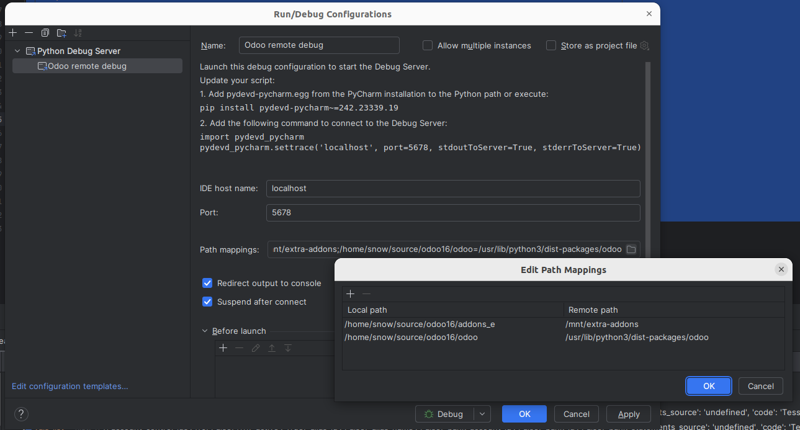
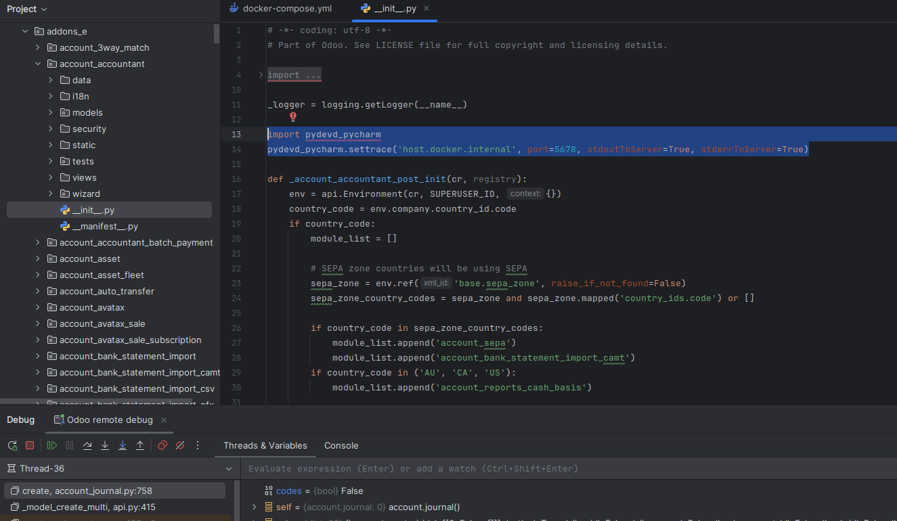
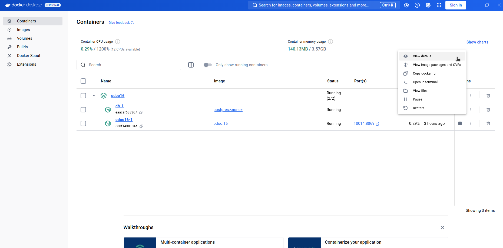
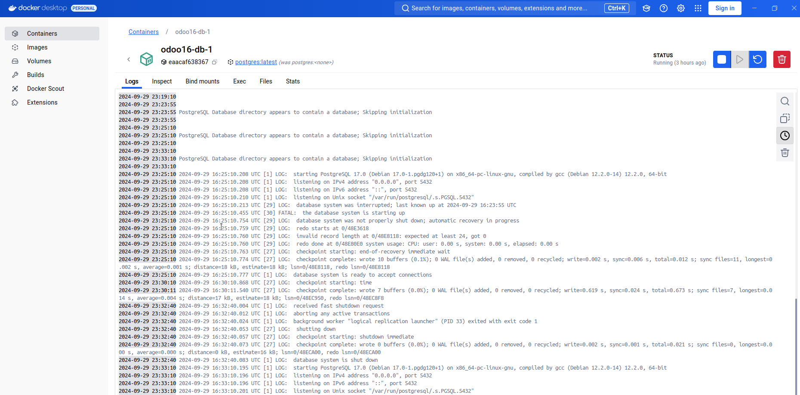
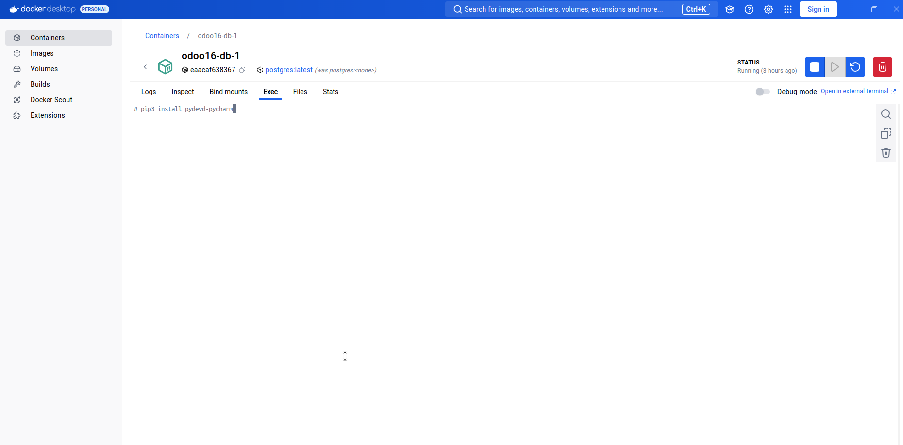
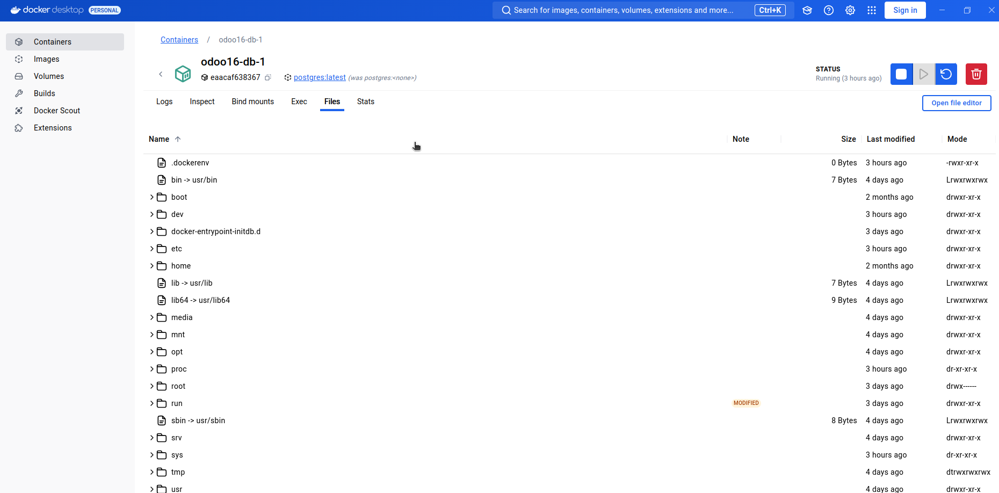

1. Kiểm tra xem context docker trên command line có khớp với context docker desktop không. (Xem owr file read_docker.md luu y Linux)
2. Images cần có: postgres,odoo
	`docker pull <image_NAME>:<image-version>`

3. Cầu hình file docker-compose.yml
4. Run/Debug Configurations in Pycharm


- Sử dụng **Python Debug Server**: localhost, port bất kỳ, config source code ánh xạ map giữa local và cointainer
- Chèn đoạn code vào một file `__init__.py` của một module bất kỳ được cài đặt 
	
    ```
	import pydevd_pycharm
	pydevd_pycharm.settrace('host.docker.internal', port=5678, stdoutToServer=True, stderrToServer=True)
	```
    
- Ngoài ra thì phải cài thêm thư viện vào cointainer odoo

    `pip install pydevd-pycharm`
- Nếu muốn debug vào core thì phải amount source code ra ngoài, xem ở mục 7

5. Build container
    
    `docker compose -f docker-compose.yml up --build`


6. DOCKER DESKTOP



- LOGS



- EXECS: xử lý lệnh trong container



- FILES



7. Amount Source code

- Zip folder addons trên container (có thể amount addons hoặc cả folder odoo)

		cd /usr/lib/python3/dist-packages/
		zip -r odoo.zip odoo

- Copy odoo.zip từ container về local 
		
		docker cp <container_NAME>:/usr/lib/python3/dist-packages/odoo.zip <path_local>

- Cần cấu hình trong docker compose volume và path trong bebug_configuration tương ứng
